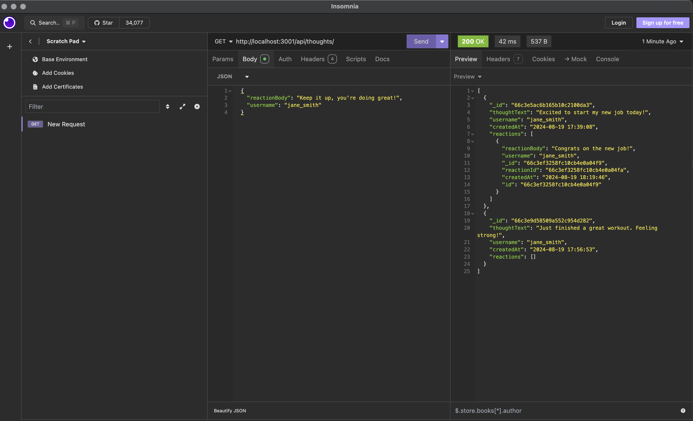

# Social Media API
 

## Description

This project is a RESTful API for a social media web application built using Express.js, MongoDB, and Mongoose ODM. The API allows users to share their thoughts, react to friends’ thoughts, and manage their friend list. It provides a set of endpoints for creating, reading, updating, and deleting users, thoughts, and reactions.

## Table of Content
- [Installation](#installation)
- [Usage](#usage)
- [Endpoints](#endpoints)
- [Technologies](#technologies)
- [License](#license)

## Installation

1. Clone the repository to your local machine:
```
git clone https://github.com/yueyue426/social-media-api.git
cd social-media-api
```
2. Install the required dependencies:
```
npm install
```
3. Set up your MongoDB connection. You can either use a local MongoDB instance or a MongoDB Atlas cluster. Update your MongoDB connection string in the `server.js` file or use environment variables.
4. Start the server:
```
node server.js
```
The server will start on `http://localhost:3001`

## Usage
Use a tool like Insomnia or Postman to interact with the API. You can perform CRUD operations on users, thoughts, and reactions using the provided endpoints.

## API Endpoints

### Users
- **GET /api/user**: Get all users.
- **GET /api/user/:id**: Get a single user by ID, populated with thoughts and friends data.
- **POST /api/user**: Create a new user.
- **PUT /api/user/:id**: Update a user by ID.
- **DELETE /api/user/:id**: Delete a user by ID.
- **POST /api/user/:id/friends/:friendId**: Remove a friend from a user's friend list.

### Thoughts
- **GET /api/thoughts**: Get all thoughts.
- **GET /api/thoughts/:id**: Get a single thought by ID.
- **POST /api/thoughts**: Create a new thought.
- **PUT /api/thoughts/:id**: Update a thought by ID.
- **DELETE /api/thoughts/:id**: Delete a thought by ID.

### Reactions
- **POST /api/thoughts/:thoughtId/reactions**: Add a reaction to a thought.
- **DELETE /api/thoughts/:thoughtId/reactions/:reactionId**: Remove a reaction by its ID.

## Technologies
- Node.js
- Express.js
- MongoDB
- Mongoose

## License
This project is licensed under the [MIT](https://opensource.org/licenses/MIT) License.

## Mock-Up


